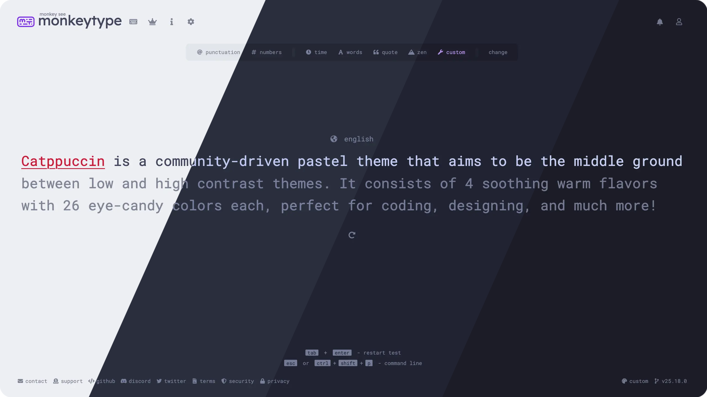

<h3 align="center">
	 
	
	Catppuccin for <a href="https://monkeytype.com">MonkeyType</a>
	
</h3>

    
    
    

  

## Previews

🌻 Latte

🪴 Frappé

🌺 Macchiato

🌿 Mocha

## Usage

> [!IMPORTANT]  
> Catppuccin Mocha is already included as a preset in MonkeyType. Open the settings, scroll down to "theme" and select "catppuccin".

Load your chosen flavour by clicking the corresponding link below. This will open MonkeyType with the theme applied:

<!-- AUTOGEN START -->
<!-- the following section is auto-generated, do not edit -->
- [🌻 Latte](https://monkeytype.com/?customTheme=eyJjIjpbIiNlZmYxZjUiLCIjODgzOWVmIiwiI2RjOGE3OCIsIiM4YzhmYTEiLCIjZTZlOWVmIiwiIzRjNGY2OSIsIiNkMjBmMzkiLCIjZTY0NTUzIiwiI2QyMGYzOSIsIiNlNjQ1NTMiXX0)
- [🪴 Frappé](https://monkeytype.com/?customTheme=eyJjIjpbIiMzMDM0NDYiLCIjY2E5ZWU2IiwiI2YyZDVjZiIsIiM4MzhiYTciLCIjMjkyYzNjIiwiI2M2ZDBmNSIsIiNlNzgyODQiLCIjZWE5OTljIiwiI2U3ODI4NCIsIiNlYTk5OWMiXX0)
- [🌺 Macchiato](https://monkeytype.com/?customTheme=eyJjIjpbIiMyNDI3M2EiLCIjYzZhMGY2IiwiI2Y0ZGJkNiIsIiM4MDg3YTIiLCIjMWUyMDMwIiwiI2NhZDNmNSIsIiNlZDg3OTYiLCIjZWU5OWEwIiwiI2VkODc5NiIsIiNlZTk5YTAiXX0)
- [🌿 Mocha](https://monkeytype.com/?customTheme=eyJjIjpbIiMxZTFlMmUiLCIjY2JhNmY3IiwiI2Y1ZTBkYyIsIiM3Zjg0OWMiLCIjMTgxODI1IiwiI2NkZDZmNCIsIiNmMzhiYTgiLCIjZWJhMGFjIiwiI2YzOGJhOCIsIiNlYmEwYWMiXX0)
<!-- AUTOGEN END -->

## 💝 Thanks to

- [Jazil T S](https://github.com/tsjazil)
- [Lexi](https://github.com/ShyyLexi/)

&nbsp;

Copyright &copy; 2021-present <a href="https://github.com/catppuccin" target="_blank">Catppuccin Org</a>

